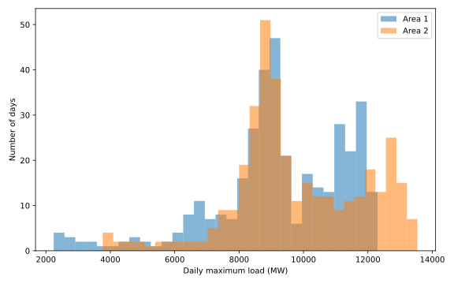
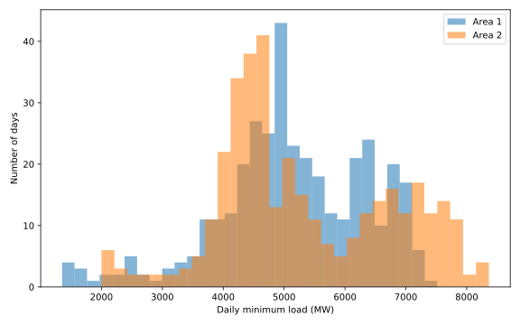
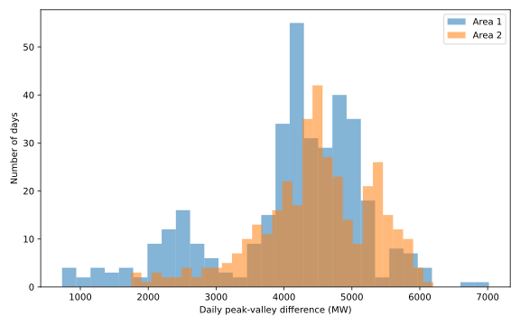
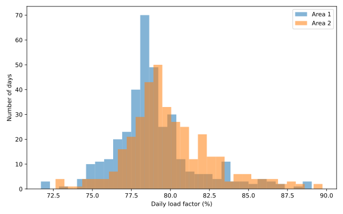
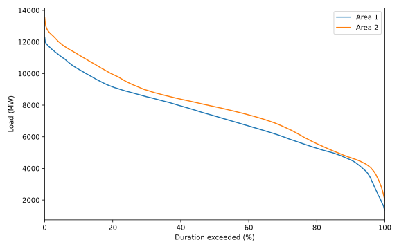
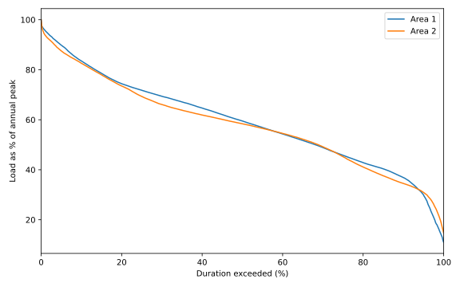

# Question 1 — 2014 年两地区负荷特征分析

## 1. 数据与指标口径

- 数据：`Area1_Load.csv`、`Area2_Load.csv`
- 时间：2014-01-01 至 2014-12-31
- 每日 96 个 15 min 采样点，共 365 × 96 = 35,040 个样本/地区
- 单位：MW
- 2014 年两个地区均未发现缺失值或非正负荷值
- 日负荷率 = 日平均负荷 / 日最高负荷

## 2. 总体负荷水平

| 指标 | Area 1 | Area 2 |
|---|---:|---:|
| 年平均负荷（MW） | 7,274.30 | 7,855.88 |
| 年最大负荷（MW） | 12,296.85 | 13,536.75 |
| 年最小负荷（MW） | 1,351.87 | 2,000.13 |
| 年平均负荷 / 年峰值 | 59.16% | 58.03% |

Area 2 的年平均负荷与年峰值均高于 Area 1，说明其总体负荷规模更大。

## 3. 四项日负荷指标分布

### 3.1 日最高负荷

| 统计量 | Area 1（MW） | Area 2（MW） |
|---|---:|---:|
| 均值 | 9,222.65 | 9,786.92 |
| 标准差 | 2,074.83 | 2,032.75 |
| CV | 22.50% | 20.77% |
| 中位数 | 9,155.30 | 9,296.04 |
| 最小值 | 2,242.06 | 3,763.70 |
| 最大值 | 12,296.85 | 13,536.75 |

Area 2 的日峰值 CV 更低，日峰值水平相对更稳定。两地区最大日峰值均出现在
**2014-07-24**；
最低日峰值分别出现在 **2014-01-31**
和 **2014-02-01**。

### 3.2 日最低负荷

| 统计量 | Area 1（MW） | Area 2（MW） |
|---|---:|---:|
| 均值 | 5,140.93 | 5,330.65 |
| 标准差 | 1,231.06 | 1,422.21 |
| CV | 23.95% | 26.68% |
| 中位数 | 5,055.46 | 4,929.35 |
| 最小值 | 1,351.87 | 2,000.13 |
| 最大值 | 7,516.44 | 8,364.61 |

Area 2 的日最低负荷水平更高，但最低负荷的相对波动略大。

### 3.3 日峰谷差

| 统计量 | Area 1（MW） | Area 2（MW） |
|---|---:|---:|
| 均值 | 4,081.72 | 4,456.27 |
| 标准差 | 1,122.15 | 854.71 |
| CV | 27.49% | 19.18% |
| 中位数 | 4,263.00 | 4,490.01 |
| 最小值 | 730.33 | 1,750.49 |
| 最大值 | 7,018.12 | 6,198.86 |

Area 2 的平均峰谷差更大，但其峰谷差 CV 明显更低：
Area 1 为 27.49%，Area 2 为 19.18%。
这说明 Area 2 的日内峰谷幅度虽大，但跨日期更稳定。

### 3.4 日负荷率

| 统计量 | Area 1 | Area 2 |
|---|---:|---:|
| 均值 | 78.96% | 79.98% |
| 标准差 | 2.66% | 2.80% |
| 中位数 | 78.58% | 79.47% |
| 最小值 | 71.70% | 72.64% |
| 最大值 | 89.05% | 89.74% |

Area 2 平均日负荷率略高，全天负荷相对日峰值更饱满。

## 4. 负荷持续曲线

负荷持续曲线将全年 35,040 个负荷点按从高到低排序，横轴为“负荷被超过的时间比例”。

为了排除两个地区绝对负荷规模不同的影响，同时绘制峰值归一化曲线：

| 被超过时间比例 | Area 1（MW） | Area 2（MW） |
|---:|---:|---:|
| 1% | 11,757.42 | 12,696.11 |
| 5% | 11,043.54 | 11,848.59 |
| 10% | 10,267.00 | 11,179.61 |
| 25% | 8,821.71 | 9,389.44 |
| 50% | 7,318.05 | 7,900.42 |
| 75% | 5,627.33 | 6,119.40 |
| 90% | 4,537.00 | 4,674.86 |
| 95% | 3,686.15 | 4,188.68 |
| 99% | 1,902.17 | 2,812.51 |

Area 2 在绝对负荷上整体更高。归一化后，两地区主体区间较接近，但 Area 1 的极低负荷尾部下降更深，
说明特殊日期造成的极端低负荷状态更突出。

## 5. 两地区主要差异

**Area 1**
- 负荷规模较低；
- 日最高负荷相对波动更大；
- 日峰谷差跨日期变化明显更大；
- 负荷持续曲线低负荷尾部更深；
- 特殊日期对负荷水平影响更强。

**Area 2**
- 总体负荷规模更高；
- 日最高负荷相对更稳定；
- 峰谷差虽然更大，但峰谷结构更稳定；
- 平均日负荷率略高；
- 整体日内形态更规则。

## 6. 初步可预测性判断

**初步判断：Area 2 更可能获得更高的短期负荷预测精度。**

核心依据是 Area 2 的日峰值 CV 较低、峰谷差 CV 明显较低，并且极端低负荷尾部没有 Area 1 那么突出。

作为辅助验证，计算简单的历史滞后规律：

| 辅助指标 | Area 1 | Area 2 |
|---|---:|---:|
| 相邻日同一时刻相关系数 | 0.8979 | 0.9557 |
| 前 1 日直接预测 MAPE | 9.10% | 5.91% |
| 7 日滞后同一时刻相关系数 | 0.8667 | 0.9120 |
| 前 7 日直接预测 MAPE | 12.04% | 9.65% |

Area 2 的滞后相关性更高，简单历史持续法误差也更低，因此进一步支持其规律性更强。
该结论仍属于第 1 问阶段的初步判断，后续 Question 4/5 会用严格时间序列回测验证。

## 7. 输出文件

- `Q1_ANALYSIS.md`
- `Q1_daily_metrics_2014.csv`
- `Q1_summary_statistics.csv`
- `Q1_load_duration_points.csv`
- `q1_load_analysis.py`
- `figures/daily_max_distribution.svg`
- `figures/daily_min_distribution.svg`
- `figures/peak_valley_distribution.svg`
- `figures/load_factor_distribution.svg`
- `figures/load_duration_curve.svg`
- `figures/load_duration_curve_normalized.svg`
