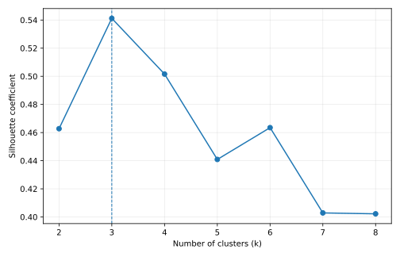
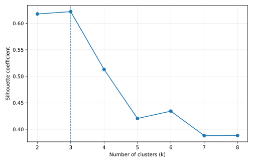
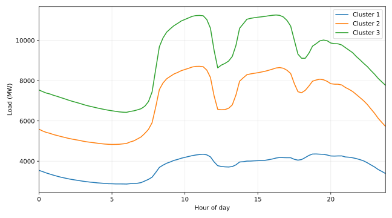
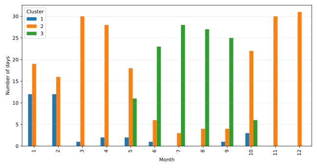
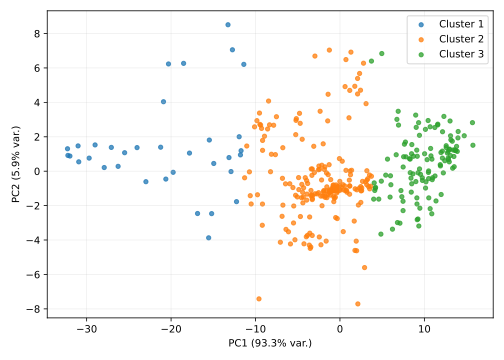
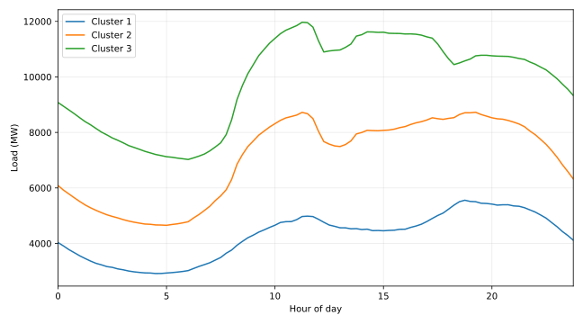
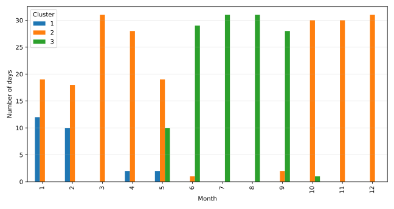
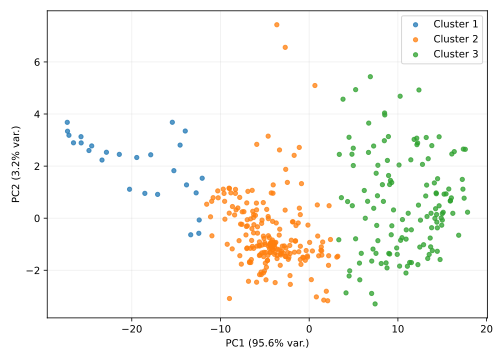

# Question 2 — KMeans 日负荷曲线聚类分析

## 1. 方法

- 分析期间：2014-01-01 至 2014-12-31，每个地区 365 天。
- 每天使用 96 个 15 分钟负荷点作为一个样本，因此原始特征维度为 96。
- 聚类前对每个 15 分钟特征在全年 365 天之间进行 `StandardScaler` 标准化。
  这样保留日负荷水平与曲线形态差异，同时避免某些绝对负荷较高的时刻在欧氏距离中占据过大权重。
- 对 `k = 2...8` 分别运行 KMeans，`random_state=42`，`n_init=50`。
- 使用 Silhouette coefficient 选择最优 k。数值越接近 1，类内越紧密、类间越分离。
- 聚类标签本身没有自然顺序，因此最终按各簇平均日负荷从低到高重新编号为 Cluster 1、2、3。
- 气象数据只用于解释聚类，不参与本题 KMeans 拟合。

## 2. 聚类有效性

### Area 1

| k | Silhouette |
|---:|---:|
| 2 | 0.4627 |
| 3 | 0.5412 |
| 4 | 0.5016 |
| 5 | 0.4409 |
| 6 | 0.4635 |
| 7 | 0.4029 |
| 8 | 0.4022 |

**最优 k = 3**。

### Area 2

| k | Silhouette |
|---:|---:|
| 2 | 0.6176 |
| 3 | 0.6220 |
| 4 | 0.5129 |
| 5 | 0.4204 |
| 6 | 0.4343 |
| 7 | 0.3881 |
| 8 | 0.3883 |

**最优 k = 3**。

两个地区的轮廓系数均在 **k=3** 时达到最高，因此后续统一采用 3 类，便于比较两地区的负荷类型。

## 3. 聚类特征

### Area 1

| Cluster | 天数 | 占比 | 日均负荷 MW | 日峰值 MW | 日谷值 MW | 峰谷差 MW | 日负荷率 | 周末占比 | 平均温度 °C | 日最高温 °C |
|---:|---:|---:|---:|---:|---:|---:|---:|---:|---:|---:|
| 1 | 34 | 9.3% | 3718.13 | 4675.56 | 2744.15 | 1931.41 | 79.5% | 32.4% | 18.64 | 23.08 |
| 2 | 211 | 57.8% | 6888.10 | 8755.88 | 4802.61 | 3953.27 | 78.8% | 34.1% | 20.32 | 23.97 |
| 3 | 120 | 32.9% | 8960.95 | 11331.74 | 6414.89 | 4916.85 | 79.1% | 17.5% | 28.96 | 32.87 |

### Area 2

| Cluster | 天数 | 占比 | 日均负荷 MW | 日峰值 MW | 日谷值 MW | 峰谷差 MW | 日负荷率 | 周末占比 | 平均温度 °C | 日最高温 °C |
|---:|---:|---:|---:|---:|---:|---:|---:|---:|---:|---:|
| 1 | 26 | 7.1% | 4279.67 | 5606.32 | 2878.66 | 2727.66 | 76.1% | 34.6% | 15.53 | 21.71 |
| 2 | 209 | 57.3% | 7069.79 | 8927.28 | 4608.30 | 4318.98 | 79.2% | 28.7% | 18.71 | 23.26 |
| 3 | 130 | 35.6% | 9834.93 | 12005.06 | 6982.35 | 5022.71 | 82.0% | 26.9% | 28.20 | 33.14 |

## 4. 语义解释与分类标签

### Cluster 1：低负荷 / 节假日型曲线簇

- 两地区 Cluster 1 都是全年平均负荷最低的一组。
- 日期高度集中在 1 月下旬至 2 月上旬，同时也出现少量其他低负荷日期。
- 周末比例并不足以单独解释该簇，因此更合适的名称是‘低负荷/节假日型’，而不是简单称为‘周末型’。
- 其特征是全天负荷整体下移，代表特殊休息日、长假或其他低需求状态。

### Cluster 2：正常 / 常规负荷曲线簇

- 这是两个地区规模最大的类别，约占全年六成。
- 主要覆盖冬春、秋冬的普通日期，负荷水平居中。
- 可作为常规工作日与一般周末混合情况下的主导基准型曲线。

### Cluster 3：高温 / 夏季高负荷曲线簇

- 两地区 Cluster 3 几乎都集中在 5–10 月，6–9 月最密集。
- 平均温度和日最高温度显著高于 Cluster 1/2。
- 日均负荷、日峰值和日谷值均明显上升，符合高温期空调负荷增加的预期。
- 因此可合理标记为‘高温/夏季高负荷型’。

## 5. 两地区比较

- Area 2 的最佳三类轮廓系数高于 Area 1，说明 Area 2 的三个日负荷状态分离得更清晰。
- Area 2 的高负荷簇持续天数略多，并且在夏季月份分布更连续。
- Area 1 的低负荷簇天数略多，特殊低负荷日期对全年结构的扰动更明显。
- 这与 Question 1 中 Area 2 具有更强规律性、较低简单预测误差的初步判断一致。

## 6. 在后续预测中的使用方法

本题生成的 Cluster 标签可作为 Question 4/5 的候选分类特征，但必须避免数据泄漏：

1. 对历史训练日期，可以直接使用已经得到的聚类标签。
2. 对未来预测日期，不能使用未来真实负荷再进行聚类后把标签作为输入。
3. 正确做法是根据可提前获知的变量（月份、星期、节假日、天气等）训练一个‘日类型分类器’或建立规则，将未来日期映射到 Cluster 1/2/3。
4. 另一种做法是将聚类只用于解释和分组建模，而不直接作为未来未知特征。

## 7. 输出文件

- `Q2_ANALYSIS.md`
- `Q2_cluster_labels_2014.csv`
- `Q2_cluster_summary.csv`
- `Q2_silhouette_scores.csv`
- `Q2_cluster_profiles.csv`
- `Q2_month_distribution.csv`
- `Q2_pca_points.csv`
- `q2_kmeans_analysis.py`
- `figures/area1_silhouette.svg`, `figures/area2_silhouette.svg`
- `figures/area1_cluster_profiles.svg`, `figures/area2_cluster_profiles.svg`
- `figures/area1_cluster_months.svg`, `figures/area2_cluster_months.svg`
- `figures/area1_pca_clusters.svg`, `figures/area2_pca_clusters.svg`
