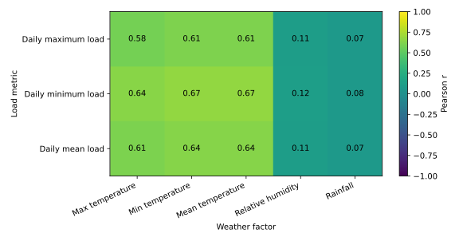
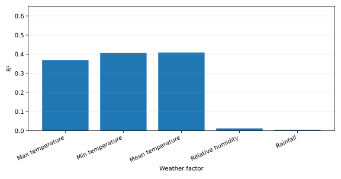
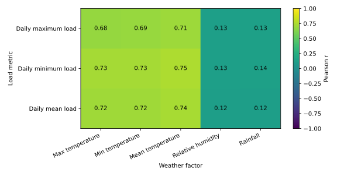
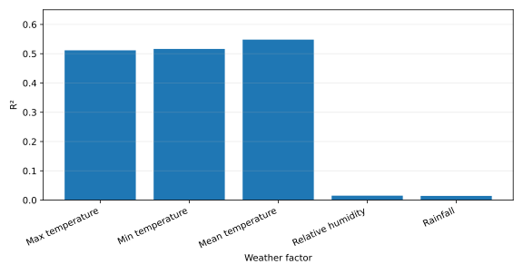
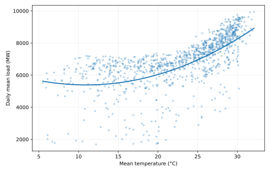
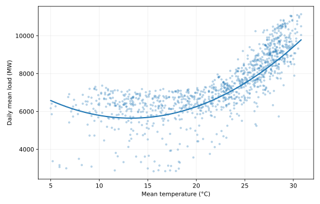
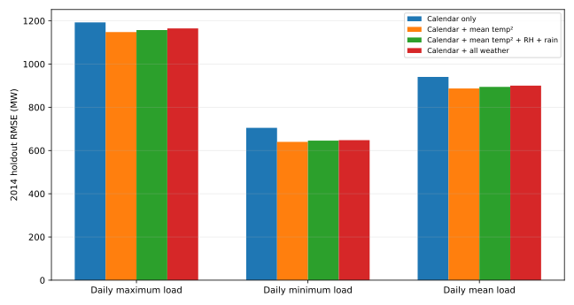
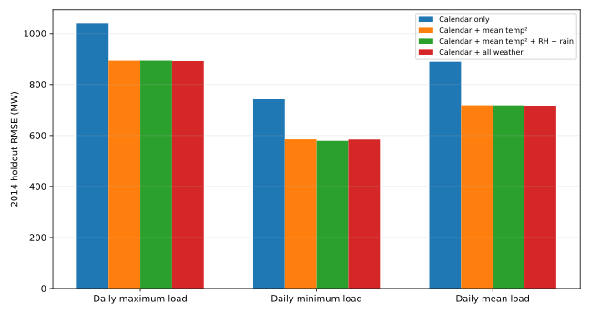

# Question 3 — 气象因素与日负荷回归分析

## 1. 分析目标与数据

- 时间范围：2012-01-01 至 2014-12-31，共 1,096 天/地区。
- 因变量：日最高负荷、日最低负荷、日平均负荷。
- 气象变量：日最高温度、日最低温度、日平均温度、相对湿度、降雨量。
- 负荷由每天 96 个 15 分钟采样点汇总得到。
- 为避免只用拟合优度判断变量价值，除全样本回归外，还采用时间顺序验证：2012–2013 训练、2014 独立测试。

## 2. 数据质量处理

不修改原始 CSV，仅在受影响变量的回归中排除明显录入异常或缺失值。

| area | date | factor | raw_value | treatment |
|---|---|---|---|---|
| Area1 | 2012-03-21 | 最高温度 | 54.9 | Excluded: obvious high-temperature transcription outlier |
| Area1 | 2012-03-27 | 最高温度 | 54.9 | Excluded: obvious high-temperature transcription outlier |
| Area1 | 2014-07-25 | 平均温度 |  | Source missing value; omitted from relevant regression |
| Area1 | 2014-07-25 | 相对湿度 |  | Source missing value; omitted from relevant regression |
| Area1 | 2012-12-03 | 降雨量 |  | Source missing value; omitted from relevant regression |
| Area1 | 2014-07-25 | 降雨量 |  | Source missing value; omitted from relevant regression |
| Area2 | 2012-10-08 | 最低温度 | -38.6 | Excluded: obvious low-temperature transcription outlier |
| Area2 | 2012-10-09 | 最低温度 | -22.4 | Excluded: obvious low-temperature transcription outlier |
| Area2 | 2012-10-10 | 最低温度 | -22.3 | Excluded: obvious low-temperature transcription outlier |
| Area2 | 2012-10-11 | 最低温度 | -24.6 | Excluded: obvious low-temperature transcription outlier |
| Area2 | 2014-08-05 | 相对湿度 |  | Source missing value; omitted from relevant regression |
| Area2 | 2012-12-03 | 降雨量 |  | Source missing value; omitted from relevant regression |

其中 Area 1 的两个 `最高温度=54.9°C`、Area 2 的四个明显异常负最低温度，以及源文件已有的少量缺失值均未被人工猜测替换；这可以避免错误插值影响变量选择。

## 3. 相关性与单变量线性回归

### Area1

Pearson 相关系数：

| Load metric | 最高温度 | 最低温度 | 平均温度 | 相对湿度 | 降雨量 |
|---|---|---|---|---|---|
| Daily maximum load | 0.584 | 0.615 | 0.615 | 0.112 | 0.074 |
| Daily minimum load | 0.642 | 0.674 | 0.675 | 0.118 | 0.083 |
| Daily mean load | 0.608 | 0.639 | 0.639 | 0.110 | 0.072 |

全样本单变量线性回归 R²：

| Load metric | 最高温度 | 最低温度 | 平均温度 | 相对湿度 | 降雨量 |
|---|---|---|---|---|---|
| Daily maximum load | 0.341 | 0.378 | 0.378 | 0.013 | 0.005 |
| Daily minimum load | 0.412 | 0.454 | 0.455 | 0.014 | 0.007 |
| Daily mean load | 0.370 | 0.408 | 0.409 | 0.012 | 0.005 |

### Area2

Pearson 相关系数：

| Load metric | 最高温度 | 最低温度 | 平均温度 | 相对湿度 | 降雨量 |
|---|---|---|---|---|---|
| Daily maximum load | 0.680 | 0.688 | 0.706 | 0.130 | 0.133 |
| Daily minimum load | 0.728 | 0.733 | 0.753 | 0.126 | 0.138 |
| Daily mean load | 0.715 | 0.719 | 0.740 | 0.123 | 0.119 |

全样本单变量线性回归 R²：

| Load metric | 最高温度 | 最低温度 | 平均温度 | 相对湿度 | 降雨量 |
|---|---|---|---|---|---|
| Daily maximum load | 0.462 | 0.473 | 0.498 | 0.017 | 0.018 |
| Daily minimum load | 0.530 | 0.537 | 0.568 | 0.016 | 0.019 |
| Daily mean load | 0.512 | 0.516 | 0.548 | 0.015 | 0.014 |

总体上，三个温度变量与负荷的线性关系明显强于湿度和降雨。Area 1 的温度变量可解释约 34%–46% 的全样本负荷变化；Area 2 约为 46%–57%。湿度与降雨的单变量 R² 仅约 0.5%–2%，单独使用时解释力很弱。

## 4. 温度非线性与 2014 独立验证

温度与用电需求并不一定严格线性，因此对三个温度变量额外测试二次回归 `load ~ T + T²`，仍严格使用 2012–2013 拟合并在 2014 测试。

### Area1：二次温度模型 2014 测试 R²

| Load metric | 最高温度 | 最低温度 | 平均温度 |
|---|---|---|---|
| Daily maximum load | 0.312 | 0.378 | 0.365 |
| Daily minimum load | 0.420 | 0.488 | 0.484 |
| Daily mean load | 0.360 | 0.428 | 0.418 |

### Area2：二次温度模型 2014 测试 R²

| Load metric | 最高温度 | 最低温度 | 平均温度 |
|---|---|---|---|
| Daily maximum load | 0.469 | 0.486 | 0.528 |
| Daily minimum load | 0.577 | 0.583 | 0.637 |
| Daily mean load | 0.529 | 0.532 | 0.586 |

二次项普遍改善 2014 外推表现，说明温度—负荷关系存在明显非线性。Area 2 的提升尤其明显，因此 Question 5 中不应只使用单一线性温度系数。

## 5. 气象因素是否能在时间规律之外继续降低误差

为了避免把季节性误认为气象因果关系，再建立一个简单的日历基准（趋势、年周期、月份、星期），并逐项加入天气变量。温度以 `T + T²` 形式加入。所有指标仍为 2014 独立测试结果。

### Area1

| Load metric | Model | RMSE (MW) | MAPE (%) | RMSE improvement vs calendar (%) |
|---|---|---|---|---|
| Daily maximum load | Calendar only | 1192.67 | 12.75 | 0.00 |
| Daily maximum load | Calendar + max temperature² | 1164.04 | 12.16 | 2.40 |
| Daily maximum load | Calendar + min temperature² | 1144.34 | 11.97 | 4.05 |
| Daily maximum load | Calendar + mean temperature² | 1148.16 | 11.88 | 3.73 |
| Daily maximum load | Calendar + humidity | 1198.72 | 12.92 | -0.51 |
| Daily maximum load | Calendar + rainfall | 1191.30 | 12.72 | 0.12 |
| Daily maximum load | Calendar + mean temperature² + humidity + rainfall | 1157.43 | 12.12 | 2.96 |
| Daily maximum load | Calendar + all weather | 1164.99 | 12.21 | 2.32 |
| Daily minimum load | Calendar only | 704.80 | 13.09 | 0.00 |
| Daily minimum load | Calendar + max temperature² | 663.95 | 12.34 | 5.80 |
| Daily minimum load | Calendar + min temperature² | 642.72 | 12.08 | 8.81 |
| Daily minimum load | Calendar + mean temperature² | 640.03 | 11.98 | 9.19 |
| Daily minimum load | Calendar + humidity | 707.37 | 13.24 | -0.36 |
| Daily minimum load | Calendar + rainfall | 703.49 | 13.06 | 0.19 |
| Daily minimum load | Calendar + mean temperature² + humidity + rainfall | 645.82 | 12.17 | 8.37 |
| Daily minimum load | Calendar + all weather | 647.91 | 12.28 | 8.07 |
| Daily mean load | Calendar only | 940.59 | 12.70 | 0.00 |
| Daily mean load | Calendar + max temperature² | 905.61 | 12.03 | 3.72 |
| Daily mean load | Calendar + min temperature² | 886.78 | 11.83 | 5.72 |
| Daily mean load | Calendar + mean temperature² | 886.96 | 11.71 | 5.70 |
| Daily mean load | Calendar + humidity | 945.31 | 12.87 | -0.50 |
| Daily mean load | Calendar + rainfall | 938.00 | 12.65 | 0.28 |
| Daily mean load | Calendar + mean temperature² + humidity + rainfall | 894.38 | 11.93 | 4.91 |
| Daily mean load | Calendar + all weather | 900.19 | 12.03 | 4.30 |

### Area2

| Load metric | Model | RMSE (MW) | MAPE (%) | RMSE improvement vs calendar (%) |
|---|---|---|---|---|
| Daily maximum load | Calendar only | 1040.86 | 8.99 | 0.00 |
| Daily maximum load | Calendar + max temperature² | 925.68 | 7.89 | 11.07 |
| Daily maximum load | Calendar + min temperature² | 967.64 | 8.25 | 7.03 |
| Daily maximum load | Calendar + mean temperature² | 893.54 | 7.54 | 14.15 |
| Daily maximum load | Calendar + humidity | 1030.80 | 9.00 | 0.97 |
| Daily maximum load | Calendar + rainfall | 1037.03 | 8.97 | 0.37 |
| Daily maximum load | Calendar + mean temperature² + humidity + rainfall | 893.89 | 7.59 | 14.12 |
| Daily maximum load | Calendar + all weather | 892.18 | 7.59 | 14.28 |
| Daily minimum load | Calendar only | 742.20 | 10.82 | 0.00 |
| Daily minimum load | Calendar + max temperature² | 618.34 | 9.26 | 16.69 |
| Daily minimum load | Calendar + min temperature² | 663.25 | 9.78 | 10.64 |
| Daily minimum load | Calendar + mean temperature² | 585.06 | 8.70 | 21.17 |
| Daily minimum load | Calendar + humidity | 726.58 | 10.65 | 2.10 |
| Daily minimum load | Calendar + rainfall | 739.95 | 10.74 | 0.30 |
| Daily minimum load | Calendar + mean temperature² + humidity + rainfall | 578.90 | 8.66 | 22.00 |
| Daily minimum load | Calendar + all weather | 584.35 | 8.77 | 21.27 |
| Daily mean load | Calendar only | 889.83 | 9.57 | 0.00 |
| Daily mean load | Calendar + max temperature² | 752.70 | 8.11 | 15.41 |
| Daily mean load | Calendar + min temperature² | 808.57 | 8.67 | 9.13 |
| Daily mean load | Calendar + mean temperature² | 718.72 | 7.72 | 19.23 |
| Daily mean load | Calendar + humidity | 873.90 | 9.53 | 1.79 |
| Daily mean load | Calendar + rainfall | 882.88 | 9.50 | 0.78 |
| Daily mean load | Calendar + mean temperature² + humidity + rainfall | 718.56 | 7.76 | 19.25 |
| Daily mean load | Calendar + all weather | 716.81 | 7.76 | 19.44 |

### 5.1 Area 1

- 日历基准 RMSE：日最高约 1192.7 MW、日平均约 940.6 MW、日最低约 704.8 MW。
- 加入平均温度二次项后，RMSE 分别降至约 1148.2、887.0、640.0 MW。
- 最低温度的表现与平均温度非常接近，在日最高/日平均负荷上略优；但平均温度数据更稳定、缺失/异常更少，也更适合作为统一主变量。
- 湿度和降雨单独加入几乎没有稳定改善。

### 5.2 Area 2

- 日历基准 RMSE：日最高约 1040.9 MW、日平均约 889.8 MW、日最低约 742.2 MW。
- 加入平均温度二次项后，RMSE 分别降至约 893.5、718.7、585.1 MW，改善明显。
- 平均温度在三个目标上均是最稳定的单一气象变量。
- 湿度和降雨单独作用仍弱；与平均温度组合后，仅对部分目标有很小的额外改善。

## 6. 多重共线性与变量选择

三个温度指标彼此高度相关：

### Area1
| Variable | 最高温度 | 最低温度 | 平均温度 |
|---|---|---|---|
| 最高温度 | 1.000 | 0.937 | 0.979 |
| 最低温度 | 0.937 | 1.000 | 0.984 |
| 平均温度 | 0.979 | 0.984 | 1.000 |

### Area2
| Variable | 最高温度 | 最低温度 | 平均温度 |
|---|---|---|---|
| 最高温度 | 1.000 | 0.884 | 0.962 |
| 最低温度 | 0.884 | 1.000 | 0.971 |
| 平均温度 | 0.962 | 0.971 | 1.000 |

因此不建议在普通线性回归中同时无约束地放入最高、最低、平均温度并直接解释系数；系数会因共线性变得不稳定。若后续机器学习模型使用全部温度变量，应依靠时间序列回测、正则化或树模型控制这一问题。

## 7. 推荐用于提高负荷预测精度的气象因素

**首选：日平均温度。**

理由：

1. 对两个地区、三个负荷目标都保持较高相关性和单变量 R²；
2. 在 2014 独立测试中，加入平均温度二次项能稳定降低日历基准 RMSE；
3. Area 2 的改善尤其显著，说明温度对其负荷具有较强预测价值；
4. 与最高/最低温度相比，平均温度在本数据中没有明显异常录入问题，工程上更稳健。

**次选：最低温度（Area 1 可重点测试）以及相对湿度。**

- Area 1 的最低温度在部分 2014 验证指标上与平均温度持平或略优，可作为候选补充变量。
- 相对湿度单独解释力很弱，但可能与高温共同作用；Question 5 中可作为交互/辅助变量通过回测决定是否保留。
- 降雨量的单变量预测价值最低之一，不建议作为核心特征；可以保留为候选变量，但必须以回测是否改善为准。

## 8. 对 Question 5 的建模建议

后续天气增强预测优先采用以下特征层级：

1. 基础：历史负荷滞后 + 星期/月/节假日等日历特征；
2. 必选天气：平均温度及非线性项（如 `T²`，或树模型自动学习非线性）；
3. 候选天气：最高温度、最低温度、相对湿度、降雨量；
4. 是否保留候选变量只根据滚动时间序列回测决定，不能依据训练集拟合优度。

## 9. 输出文件

- `Q3_ANALYSIS.md`
- `Q3_data_quality.csv`
- `Q3_correlations.csv`
- `Q3_univariate_regression.csv`
- `Q3_validation_metrics.csv`
- `q3_weather_regression.py`
- `figures/area1_weather_correlation.svg`
- `figures/area2_weather_correlation.svg`
- `figures/area1_loadmean_univariate_r2.svg`
- `figures/area2_loadmean_univariate_r2.svg`
- `figures/area1_validation_rmse.svg`
- `figures/area2_validation_rmse.svg`
- `figures/area1_mean_temperature_response.svg`
- `figures/area2_mean_temperature_response.svg`