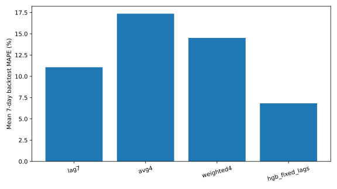
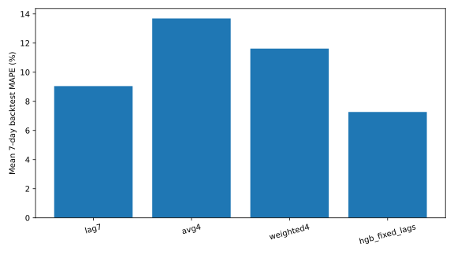
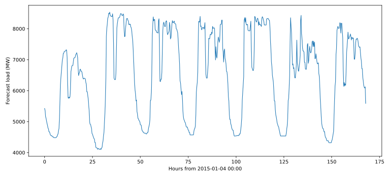
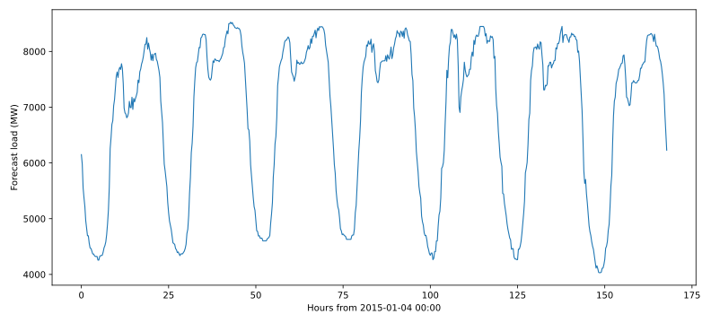

# Question 4 — 不计气象因素的短期负荷预测

## 1. 预测目标与约束

- 预测区间：2015-01-04 至 2015-01-10，共 7 天。
- 每天 96 个 15 min 点，每个地区共 672 个预测值。
- 本题完全不使用气象数据。
- 已知负荷截止 2015-01-03；预测期真实负荷不可见。
- 严格防止时间泄漏：所有机器学习负荷滞后均为 7、14、21、28、35、42、49、56 天，不使用未来真实 `lag_1d`，因此整个 7 天 horizon 可直接预测而不递归引用未知真实值。

## 2. 候选模型

1. `lag7`：上周同日同一时刻。
2. `avg4`：过去四周同一 weekday/slot 的等权平均。
3. `weighted4`：过去四周按 0.4/0.3/0.2/0.1 加权。
4. `hgb_fixed_lags`：HistGradientBoostingRegressor；特征包括月份、星期、周末、年周期、15 min slot 周期编码，以及 7–56 天固定周滞后及其统计量。

最终模型不是凭全样本拟合优度选择，而由历史 rolling-origin 7-day backtest 的平均 MAPE 决定。

## 3. 时间序列回测设计

在 2014 年设置 13 个约每 4 周一次的星期日起点，每次只用该起点之前可获得的负荷训练/构造特征，然后预测后续完整 7 天。没有随机 train/test split。

### Area 1

| Model | Mean MAE (MW) | Mean RMSE (MW) | Mean MAPE | Fold MAPE SD |
|---|---:|---:|---:|---:|
| lag7 | 573.04 | 840.85 | 11.07% | 12.14 pp |
| avg4 | 769.81 | 961.32 | 17.36% | 27.81 pp |
| weighted4 | 658.09 | 859.90 | 14.52% | 21.06 pp |
| hgb_fixed_lags | 412.37 | 543.10 | 6.83% | 5.26 pp |

**选择：`hgb_fixed_lags`**。

历史被选模型的单日 MAPE 分布：P10=1.73%，中位数=4.03%，P90=18.67%。

### Area 2

| Model | Mean MAE (MW) | Mean RMSE (MW) | Mean MAPE | Fold MAPE SD |
|---|---:|---:|---:|---:|
| lag7 | 616.24 | 809.11 | 9.04% | 6.67 pp |
| avg4 | 837.80 | 980.64 | 13.69% | 15.36 pp |
| weighted4 | 724.90 | 872.25 | 11.62% | 11.52 pp |
| hgb_fixed_lags | 531.00 | 649.99 | 7.27% | 3.53 pp |

**选择：`hgb_fixed_lags`**。

历史被选模型的单日 MAPE 分布：P10=2.62%，中位数=5.59%，P90=13.55%。

## 4. 2015-01-04 至 2015-01-10 最终预测

### Area 1

- 预测均值：6536.03 MW
- 预测最大值：8535.24 MW
- 预测最小值：4101.94 MW

正式提交文件：`Q4_Area1_Load.csv`。

### Area 2

- 预测均值：6834.78 MW
- 预测最大值：8524.40 MW
- 预测最小值：4031.23 MW

正式提交文件：`Q4_Area2_Load.csv`。

## 5. 在不知道实际负荷时的准确度推断

准确度只能依据严格历史外推表现推断，不能宣称 2015-01-04 至 10 的真实误差已经知道。

- Area 1 被选模型的 2014 rolling 7-day 平均 MAPE 为 **6.83%**，fold 间 MAPE 标准差 5.26 个百分点。
- Area 2 被选模型的对应平均 MAPE 为 **7.27%**，fold 间标准差 3.53 个百分点。
- 因此，在未来一周没有出现历史中未覆盖的结构突变时，2015 目标周的误差量级可参考上述 backtest；P10/P50/P90 单日 MAPE 给出了比单一均值更保守的历史经验区间。

从相对规律性看，历史回测 MAPE 更低、跨 fold 波动更小的地区应被认为预测置信度更高。该判断将在 Q5 使用天气后进一步比较，并在 Q6 综合确认。

## 6. 防泄漏说明

本题机器学习模型不使用 Q2 中由未来真实负荷聚类得到的标签，因为这会泄漏目标期信息；也不使用任何 2015-01-04 之后真实负荷。所有用于目标周的固定周滞后均落在 2015-01-03 或更早。

## 7. 输出文件

- `Q4_ANALYSIS.md`
- `Q4_Area1_Load.csv`
- `Q4_Area2_Load.csv`
- `Q4_Area1_candidate_forecasts.csv`
- `Q4_Area2_candidate_forecasts.csv`
- `Q4_backtest_folds.csv`
- `Q4_model_summary.csv`
- `q4_no_weather_forecast.py`
- `figures/area1_model_backtest.svg`
- `figures/area2_model_backtest.svg`
- `figures/area1_q4_forecast.svg`
- `figures/area2_q4_forecast.svg`
