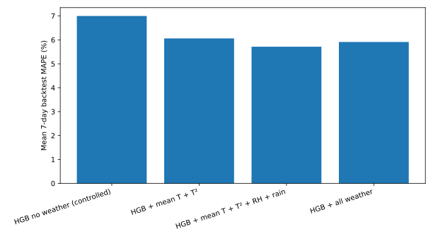
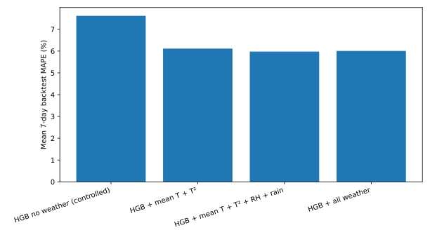
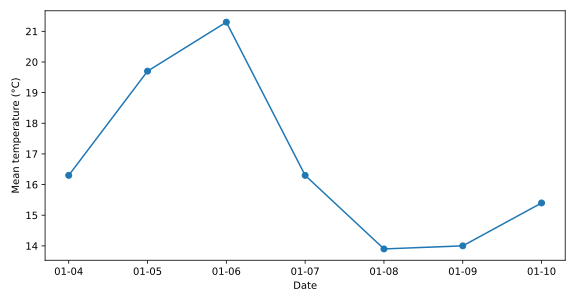
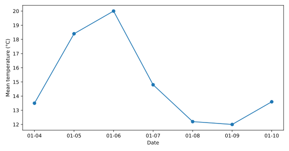
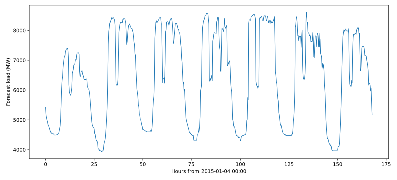
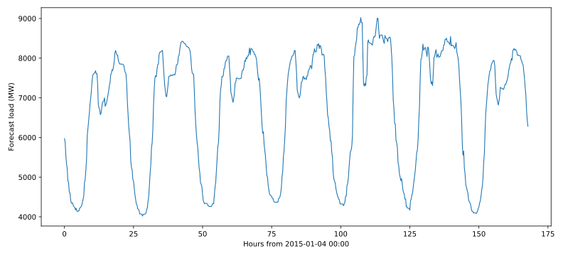

# Question 5 — 计及气象因素的短期负荷预测

## 1. 预测目标与信息边界

- 目标区间：2015-01-04 至 2015-01-10，共 7 天 × 96 个 15 min 点/地区。
- 已知负荷截止 2015-01-03。
- 本题使用提供的目标周气象数据作为外生变量。
- 为与 Q3 保持一致，重点检验平均温度及其二次项，同时把湿度、降雨和全部天气变量作为候选增强项。
- 严格防止负荷泄漏：所有负荷滞后均为 7、14、21、28、35、42、49、56 天；不会使用目标周真实负荷，也不使用未来真实 `lag_1d`。
- 历史回测使用每个验证周的观测天气模拟“天气预报可用”的场景，因此回测衡量的是**在天气信息准确可得时**的负荷模型性能；真实业务中还会叠加天气预报误差。

## 2. 与 Q3 的衔接

Q3 表明：

- 温度变量对负荷的解释力显著高于湿度和降雨；
- 温度—负荷关系存在非线性，`T + T²` 优于纯线性；
- Area 2 从平均温度获得的增益尤其明显。

因此 Q5 不盲目把所有气象变量全部塞入模型，而是在严格时间回测中比较四种 HGB 规格：

1. `no_weather`：控制组，仅日历 + 固定周滞后；
2. `mean_temp_quad`：加入平均温度和平均温度²；
3. `mean_temp_quad_hr`：再加入相对湿度和降雨；
4. `all_weather`：加入最高/最低/平均温度及平方项、湿度、降雨。

为公平比较，四个候选均使用共同训练起点 2012-01-01。

## 3. 数据质量与缺失策略

不修改源 CSV。沿用 Q3 已识别的明显气温录入异常，将其在模型特征中置为缺失值；`HistGradientBoostingRegressor` 原生支持缺失值分支，因此不人为猜测或插值异常气温。目标周气象数据完整。

## 4. Rolling-origin 7-day 回测

与 Q4 相同，在 2014 年使用 13 个约每四周一次的星期日起点。每个 fold 只使用预测起点之前的负荷训练，再使用该验证周天气预测后续完整七天。

### Area 1

| Model | Mean MAE (MW) | Mean RMSE (MW) | Mean MAPE | Fold MAPE SD |
|---|---:|---:|---:|---:|
| HGB no weather (controlled) | 428.74 | 546.20 | 7.00% | 4.84 pp |
| HGB + mean T + T² | 363.53 | 475.30 | 6.06% | 4.51 pp |
| HGB + mean T + T² + RH + rain | 343.60 | 450.86 | 5.71% | 3.93 pp |
| HGB + all weather | 344.52 | 465.37 | 5.91% | 4.39 pp |

**最佳天气模型：HGB + mean T + T² + RH + rain (`mean_temp_quad_hr`)**。

- 最佳天气模型平均 MAPE：**5.71%**。
- 同训练窗口无天气控制组 MAPE：**7.00%**。
- 相对 MAPE 改善：**18.35%**。
- 单日 MAPE：P10=1.78%，中位数=3.43%，P90=13.49%。

### Area 2

| Model | Mean MAE (MW) | Mean RMSE (MW) | Mean MAPE | Fold MAPE SD |
|---|---:|---:|---:|---:|
| HGB no weather (controlled) | 535.27 | 655.48 | 7.62% | 4.76 pp |
| HGB + mean T + T² | 401.86 | 495.22 | 6.11% | 4.81 pp |
| HGB + mean T + T² + RH + rain | 399.55 | 488.76 | 5.98% | 4.19 pp |
| HGB + all weather | 401.13 | 491.38 | 6.01% | 4.30 pp |

**最佳天气模型：HGB + mean T + T² + RH + rain (`mean_temp_quad_hr`)**。

- 最佳天气模型平均 MAPE：**5.98%**。
- 同训练窗口无天气控制组 MAPE：**7.62%**。
- 相对 MAPE 改善：**21.55%**。
- 单日 MAPE：P10=2.09%，中位数=4.17%，P90=11.38%。

## 5. 目标周气象条件

### Area 1

| Date | Tmax °C | Tmin °C | Tmean °C | RH % | Rain |
|---|---:|---:|---:|---:|---:|
| 2015-01-04 | 22.8 | 11.6 | 16.3 | 70.0 | 0.00 |
| 2015-01-05 | 23.9 | 16.8 | 19.7 | 77.0 | 0.00 |
| 2015-01-06 | 25.3 | 18.8 | 21.3 | 79.0 | 0.00 |
| 2015-01-07 | 22.1 | 14.6 | 16.3 | 74.0 | 0.00 |
| 2015-01-08 | 17.9 | 10.2 | 13.9 | 54.0 | 0.00 |
| 2015-01-09 | 17.4 | 11.1 | 14.0 | 53.0 | 0.00 |
| 2015-01-10 | 19.9 | 12.0 | 15.4 | 54.0 | 0.00 |

### Area 2

| Date | Tmax °C | Tmin °C | Tmean °C | RH % | Rain |
|---|---:|---:|---:|---:|---:|
| 2015-01-04 | 22.0 | 7.6 | 13.5 | 78.0 | 0.00 |
| 2015-01-05 | 22.4 | 15.9 | 18.4 | 80.0 | 0.00 |
| 2015-01-06 | 24.6 | 17.9 | 20.0 | 86.0 | 0.40 |
| 2015-01-07 | 19.4 | 12.5 | 14.8 | 76.0 | 0.00 |
| 2015-01-08 | 18.1 | 7.6 | 12.2 | 60.0 | 0.00 |
| 2015-01-09 | 17.5 | 8.2 | 12.0 | 62.0 | 0.00 |
| 2015-01-10 | 19.9 | 9.6 | 13.6 | 59.0 | 0.00 |

## 6. 2015-01-04 至 2015-01-10 最终预测

### Area 1

- 最终模型：`mean_temp_quad_hr`
- 预测均值：6478.70 MW
- 预测最大值：8613.30 MW
- 预测最小值：3932.17 MW

### Area 2

- 最终模型：`mean_temp_quad_hr`
- 预测均值：6709.67 MW
- 预测最大值：9022.10 MW
- 预测最小值：4018.07 MW

## 7. 天气是否值得加入

判断标准不是全样本 R²，而是相同历史外推任务下天气模型相对无天气控制组的 MAPE 改善。如果增益为正且跨 fold 稳定，说明天气提供了日历和历史负荷之外的额外信息；如果湿度/降雨规格没有继续改善，则不应为了变量数量而保留它们。

这一结果与 Q3 的变量筛选形成闭环：Q3 用日尺度回归确定哪些天气变量具有稳定解释/验证价值，Q5 再在真正的 15 分钟七日预测任务中检验其实际预测贡献。

## 8. 与 Q4 的关系

Q4 与 Q5 的最终模型训练窗口并不完全相同：Q4 可使用更早的纯负荷历史，而 Q5 的天气增强模型受天气数据从 2012 年开始的约束。因此，最严格的“天气净增益”应以本题的共同训练窗口 A/B 控制结果为准，而不是简单拿 Q4 的最终 backtest 数字相减。

Q4 仍作为“没有任何天气信息时”的正式预测基线；Q5 给出“天气信息可用时”的正式预测结果。

## 9. 提交与输出

分析目录生成：

- `Q5_ANALYSIS.md`
- `Q5_Area1_Load.csv`
- `Q5_Area2_Load.csv`
- `Q5_Area1_candidate_forecasts.csv`
- `Q5_Area2_candidate_forecasts.csv`
- `Q5_backtest_folds.csv`
- `Q5_model_summary.csv`
- `Q5_target_week_weather.csv`
- `q5_weather_forecast.py`
- `figures/area1_weather_model_backtest.svg`
- `figures/area2_weather_model_backtest.svg`
- `figures/area1_q5_forecast.svg`
- `figures/area2_q5_forecast.svg`
- `figures/area1_target_week_weather.svg`
- `figures/area2_target_week_weather.svg`

正式 XLSX 提交文件将在结果验证后从上述七日预测表无损转换，以保持与题目附件命名要求一致。
