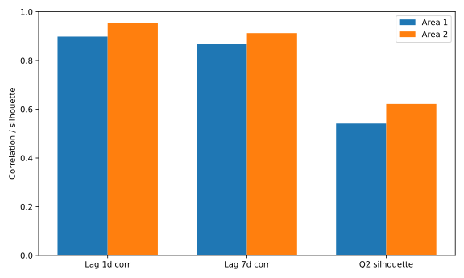
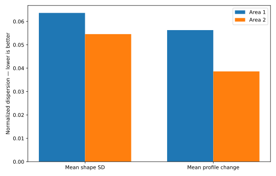
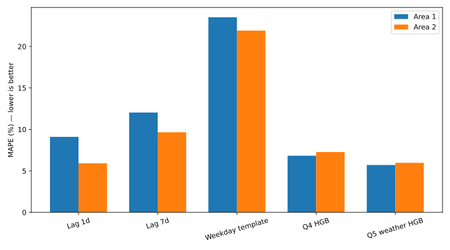

# Question 6 — 两地区负荷规律性综合评价

## 1. 评价结论

综合 Q1–Q5 与本题新增的独立规律性指标，**Area 2 的底层负荷结构整体更规则、更稳定**；但需要保留一个重要限定：在 Q4/Q5 的 HGB 七日回测中，Area 1 的平均 MAPE 略低。因此，结论不是“Area 2 在所有预测模型上误差都更小”，而是：

- **Area 2：周期结构更清晰、简单历史规律更强、跨回测稳定性更好，天气信息带来的相对增益更大。**
- **Area 1：结构性扰动更强，但经过非线性机器学习建模后，当前 Q4/Q5 回测的平均 MAPE 略优。**

在本题列出的 12 项方向明确的证据中，Area 2 在 **10** 项占优，Area 1 在 **2** 项占优。这个计数只用于展示证据方向，不作为人为加权的“总分”。

## 2. Q1–Q5 已有证据汇总

### 2.1 Q1：负荷波动与滞后规律

2014 年 Area 2 的日峰值 CV 和峰谷差 CV 更低；Q1 已经提示其日内结构跨日期更稳定。本题重新从原始负荷计算的同一时刻滞后规律如下：

| 指标 | Area 1 | Area 2 | 更规则 |
|---|---:|---:|---|
| 1 日滞后相关系数 | 0.898 | 0.956 | Area 2 |
| 1 日 persistence MAPE | 9.10% | 5.91% | Area 2 |
| 7 日滞后相关系数 | 0.867 | 0.912 | Area 2 |
| 7 日 persistence MAPE | 12.04% | 9.65% | Area 2 |

简单 persistence 不需要复杂拟合，因此它是判断“原始规律性”的直接证据。Area 2 的同一时刻相关性更高、直接历史复制误差更低，说明其周期重复性更强。

### 2.2 Q2：日负荷状态可分性

最佳 KMeans 聚类均为 `k=3`，但最佳轮廓系数为：

- Area 1：**0.5412**
- Area 2：**0.6220**

Area 2 明显更高，说明其低负荷、正常和高温高负荷三种日状态类内更紧、类间更清晰。这是“规律性更容易被离散状态描述”的证据。

### 2.3 Q4：无天气七日预测

严格 rolling-origin 回测的最优无天气模型均为 `hgb_fixed_lags`：

| 指标 | Area 1 | Area 2 |
|---|---:|---:|
| 平均 MAPE | 6.83% | 7.27% |
| 平均 RMSE | 543.10 MW | 649.99 MW |
| fold MAPE SD | 5.26 pp | 3.53 pp |

Area 1 的平均 MAPE 略低，但 Area 2 的 fold 波动显著更小（3.53 vs 5.26 pp）。因此 Area 2 的预测表现更**稳定**，Area 1 的平均精度在当前 HGB 规格下略好。

### 2.4 Q5：天气增强七日预测

两地区最佳天气模型均为 `mean_temp_quad_hr`：

| 指标 | Area 1 | Area 2 |
|---|---:|---:|
| 最佳天气模型 MAPE | 5.71% | 5.98% |
| fold MAPE SD | 3.93 pp | 4.19 pp |
| 相对无天气控制组改善 | 18.35% | 21.55% |

Area 1 的绝对 MAPE 仍略低，但 Area 2 从天气获得的相对改善更大。这与 Q3 中 Area 2 对平均温度的关系更强一致，说明其负荷变化更能由可观测外生因素解释。

## 3. 本题新增的“其他证据”

### 3.1 归一化日负荷形态稳定性

为排除两个地区绝对负荷规模差异，把每天 96 点除以当日日均负荷，再观察同一 slot 跨日离散程度。

| 指标 | Area 1 | Area 2 | 含义 |
|---|---:|---:|---|
| 96 个 slot 的平均标准差 | 0.0636 | 0.0546 | 越低越稳定 |
| slot 标准差 P90 | 0.0897 | 0.0744 | 越低越稳定 |
| 相邻日归一化曲线 RMS 变化 | 0.0563 | 0.0386 | 越低越稳定 |
| 上述变化 P90 | 0.1448 | 0.0745 | 越低越稳定 |

这组指标直接考察“曲线形状是否稳定”，而不是只看负荷水平。它与 Q1 的峰谷差 CV、Q2 的聚类可分性互为补充。

### 3.2 完全样本外的 weekday/slot 模板检验

再建立一个极简且无信息泄漏的基准：只使用 **2009–2013** 历史数据，按星期几和 15 分钟 slot 计算中位数模板，然后一次性预测整个 2014 年。它没有用 2014 的真实负荷拟合任何参数。

| 指标 | Area 1 | Area 2 |
|---|---:|---:|
| MAE | 1437.21 MW | 1758.85 MW |
| RMSE | 1846.31 MW | 2290.72 MW |
| MAPE | 23.52% | 21.91% |
| 仅用 2013 模板预测 2014 MAPE | 21.86% | 19.21% |

这个测试的意义在于：如果一个地区的负荷日历规律更稳定，那么极简单的 weekday/slot 历史模板就应当表现更好。它避免用复杂模型能力掩盖底层规律性的差异。

## 4. 为什么“规律性更强”与“当前 HGB 平均 MAPE 更低”可能不是同一地区

两者并不矛盾：

1. **规律性**描述数据生成过程的重复性、稳定性和可解释性；
2. **模型平均误差**还取决于模型结构、训练窗口、异常日分布和模型对复杂非线性的适配程度；
3. Area 1 的模式虽然更容易出现特殊扰动，但 HGB 可能更有效地拟合这些非线性，因此在当前 13 个回测周上取得略低的平均 MAPE；
4. Area 2 的优势更集中在简单基准、聚类结构和跨 fold 稳定性，这些指标更直接反映底层规律。

因此，不能只凭 Q4/Q5 单一平均 MAPE 就推翻 Q1/Q2 的结构证据，也不能因为 Area 2 结构更规则就声称它在所有模型上都必然更准。

## 5. 综合评价

**综合结论：Area 2 的整体负荷规律性优于 Area 1。**

主要理由是：

- 同一时刻日/周滞后相关性更强，简单 persistence 误差更低；
- 日负荷聚类轮廓系数更高，典型状态更清晰；
- Q4 的 rolling-origin 误差跨 fold 更稳定；
- Q5 中天气变量带来的相对改善更大，说明负荷更容易被可观测气象因素解释；
- 本题新增的归一化曲线稳定性与样本外 weekday/slot 模板提供了独立佐证。

与此同时，**Area 1 在当前 Q4/Q5 HGB 回测中的平均 MAPE 略低**，应作为模型层面的反例和限定条件明确保留。若目标是“哪个地区的数据生成规律更稳定”，选择 Area 2；若目标是“当前已实现的 HGB 模型在这组回测上的平均误差谁更低”，则是 Area 1。

## 6. 防泄漏与解释边界

- 新增结构指标仅使用 2014 年及以前的历史数据；
- weekday/slot 样本外检验只用 2009–2013 拟合、2014 验证；
- 不使用 2015-01-04 至 10 的任何真实负荷；
- Q4/Q5 证据直接读取已完成的 rolling-origin 结果，不重新用未来数据选择模型；
- 证据计数不等价于统计显著性检验，也不是人为构造的综合评分。

## 7. 输出文件

- `Q6_ANALYSIS.md`
- `Q6_structural_metrics.csv`
- `Q6_evidence_scorecard.csv`
- `q6_regularity_evaluation.py`
- `figures/regularity_correlation_evidence.svg`
- `figures/regularity_prediction_evidence.svg`
- `figures/regularity_shape_stability.svg`
